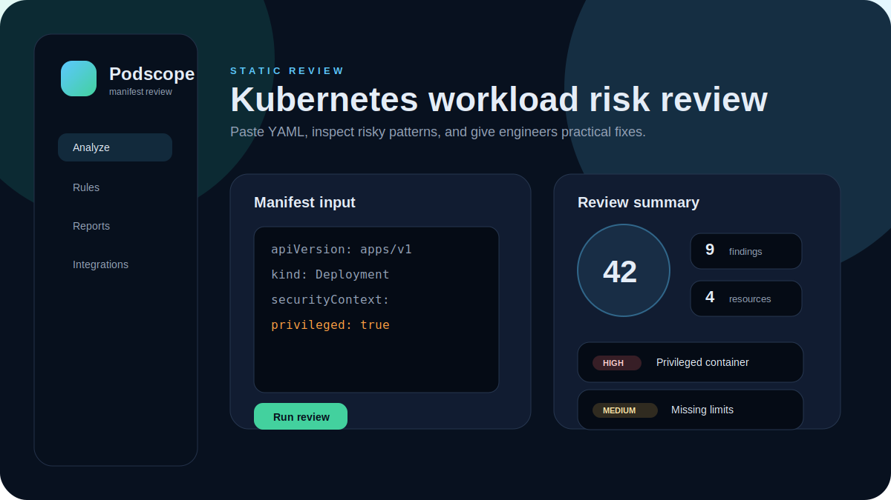
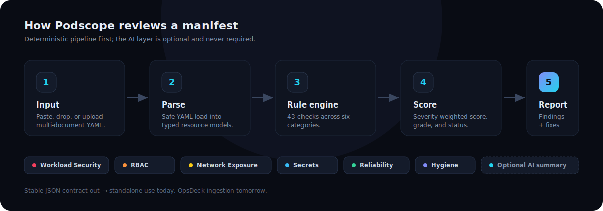

# Podscope

**Kubernetes manifest review for platform, SRE, and DevSecOps teams.** Podscope inspects Kubernetes YAML *before* it reaches a cluster and turns risky workload, RBAC, exposure, networking, secrets, and reliability patterns into clear findings with severity, impact, remediation, and copy-ready fixes.



Podscope is the Kubernetes review module of a larger DevSecOps platform (OpsDeck). It is fully usable on its own today and exposes a stable JSON contract so it can later plug into OpsDeck without changes to the engine.

---

## Why Podscope exists

Most Kubernetes review happens too late — after manifests are merged, deployed, or already running in shared clusters. Admission controllers and policy engines are powerful but operate at apply time and are hard to use as a fast feedback loop during a pull request or design review.

Podscope fills the gap *before* apply:

- It runs as a quick, deterministic review loop you can use while writing or reviewing manifests.
- It explains **why** each finding matters, not just that a rule failed — useful for engineers still learning Kubernetes security.
- It produces a transparent score so a change can be gated, compared, or tracked over time.

Podscope is not a replacement for admission control, runtime security, or a full posture platform. It is a pre-deployment review gate.

---

## What it detects

43 deterministic checks across six categories. Every finding maps back to one rule in the catalog.

| Category | Examples |
| --- | --- |
| **Workload Security** | privileged containers, run-as-root, privilege escalation, dangerous capabilities, host namespaces, hostPath, missing seccomp / read-only root, `latest` and unpinned images |
| **RBAC** | wildcard verbs/resources/apiGroups, `cluster-admin` bindings, broad subjects (`system:authenticated`, anonymous), Secret access |
| **Network Exposure** | LoadBalancer / NodePort services, ingress without TLS, wildcard hosts, missing NetworkPolicy, allow-all ingress/egress policies |
| **Secrets** | hardcoded credentials in env vars, secret-like values in ConfigMaps, inline Secret data, secrets consumed as env vars |
| **Reliability** | missing requests/limits, missing liveness/readiness probes, single replica, missing PodDisruptionBudget, missing spread / anti-affinity |
| **Hygiene** | missing recommended labels, missing namespace, `default` namespace usage, missing ownership metadata |

Supported resource kinds include Pod, Deployment, StatefulSet, DaemonSet, Job, CronJob, ReplicaSet, Service, Ingress, ConfigMap, Secret, Role, ClusterRole, RoleBinding, ClusterRoleBinding, ServiceAccount, NetworkPolicy, PodDisruptionBudget, and Namespace. Multi-document YAML bundles are parsed as a whole, so cross-resource checks (such as NetworkPolicy coverage per namespace) work.

Checks are informed by the [Kubernetes Pod Security Standards](https://kubernetes.io/docs/concepts/security/pod-security-standards/), CIS Kubernetes Benchmark concepts, and the NSA/CISA Kubernetes Hardening Guidance.

---

## Architecture



The backend runs a deterministic pipeline: **parse → typed resource models → rule engine → scoring → report.** The optional AI layer sits on top and is never on the critical path.

```text
podscope
├── apps
│   ├── api                 FastAPI analysis service
│   │   └── app
│   │       ├── analyzer    parser, resource model, rule engine, scoring
│   │       │   └── checks  workload / rbac / networking / secrets / reliability / hygiene
│   │       ├── ai          provider abstraction (deterministic by default)
│   │       ├── examples    bundled sample manifests
│   │       ├── schemas     Pydantic request/response contracts
│   │       └── api         HTTP routes
│   └── web                 Next.js review workspace
├── docs/images             local README visuals (SVG)
├── examples                sample Kubernetes manifests
└── docker-compose.yml
```

### Tech stack

FastAPI · Pydantic · PyYAML · Next.js (App Router) · React · TypeScript · Playwright · Docker Compose.

---

## Quick start (Docker Compose)

```bash
cp .env.example .env
docker compose up --build
```

| Service | URL |
| --- | --- |
| Web | http://localhost:3000 |
| API | http://localhost:8000 |
| API docs (Swagger) | http://localhost:8000/docs |

---

## Manual setup

### Backend

```bash
cd apps/api
python -m venv .venv
source .venv/bin/activate          # Windows: .venv\Scripts\activate
pip install -r requirements.txt
uvicorn app.main:app --reload --port 8000
```

### Frontend

```bash
cd apps/web
npm install
npm run dev
```

The frontend reads the API base URL from `NEXT_PUBLIC_API_BASE_URL` (default `http://localhost:8000`).

---

## API

| Method | Endpoint | Purpose |
| --- | --- | --- |
| GET | `/health` | Liveness |
| GET | `/ready` | Readiness + AI provider status |
| GET | `/api/rules` | Full rule catalog |
| GET | `/api/examples` | Bundled sample manifests |
| POST | `/api/analyze` | Analyze Kubernetes YAML |
| POST | `/api/ai/summarize` | Natural-language readiness summary (deterministic fallback) |
| POST | `/api/ai/remediate` | Prioritized remediation items with patches |

### `POST /api/analyze`

Request:

```json
{
  "name": "checkout.yaml",
  "content": "<kubernetes yaml>",
  "project": "storefront",
  "environment": "prod",
  "options": { "strict": false, "categories": ["Workload Security", "RBAC"] }
}
```

- `project` / `environment` — optional metadata echoed back on the result.
- `options.strict` — escalates low/medium/high findings one severity level.
- `options.categories` — restrict the run to specific categories (omit for all).

Response (abridged):

```json
{
  "meta": { "schema_version": "1.0", "name": "checkout.yaml", "environment": "prod", "strict": false, "generated_at": "..." },
  "scorecard": { "score": 10, "grade": "F", "status": "fail", "explanation": "...", "checks_run": 43, "checks_passed": 24, "checks_failed": 19 },
  "summary": "Reviewed 4 resource(s) and found 26 issue(s)...",
  "resource_count": 4,
  "workload_count": 1,
  "namespace_count": 1,
  "severity_counts": { "critical": 2, "high": 6, "medium": 9, "low": 7, "info": 2 },
  "category_counts": [ { "category": "Workload Security", "count": 14 } ],
  "resources": [ { "kind": "Deployment", "name": "storefront", "namespace": "prod", "finding_count": 14, "top_severity": "critical" } ],
  "findings": [
    {
      "id": "PS-W001-1", "rule_id": "PS-W001", "title": "Privileged container",
      "severity": "critical", "status": "fail", "category": "Workload Security", "confidence": "high",
      "resource_kind": "Deployment", "resource_name": "storefront", "namespace": "prod",
      "path": "spec.containers[web].securityContext.privileged",
      "description": "...", "impact": "...", "remediation": "...",
      "fixed_example": "securityContext:\n  privileged: false", "references": ["..."]
    }
  ],
  "next_steps": ["[CRITICAL] Deployment/storefront: Remove privileged mode..."],
  "notes": ["..."]
}
```

### Example with curl

```bash
curl -s -X POST http://localhost:8000/api/analyze \
  -H "Content-Type: application/json" \
  -d '{"name":"demo.yaml","content":"apiVersion: v1\nkind: Pod\nmetadata:\n  name: demo\nspec:\n  containers:\n    - name: web\n      image: nginx:latest\n      securityContext:\n        privileged: true"}' \
  | python -m json.tool
```

---

## Scoring model

Transparent and deterministic:

1. Every review starts at **100**.
2. Each finding subtracts points by severity, multiplied by a confidence factor:
   `critical −25 · high −12 · medium −6 · low −2 · info 0` (× confidence: high 1.0, medium 0.7, low 0.45).
3. The score is capped at **0**.
4. A **grade** (A–F) and **status** (`pass` → Deployable, `review` → Needs review, `fail` → Blocked) follow from the score. Any critical finding forces a Blocked status.

The response also reports severity counts, category counts, resources analyzed, and checks passed/failed so the number is never a black box.

---

## AI features (optional)

The AI layer is a provider abstraction and is **disabled by default** (`AI_PROVIDER=none`). The app works fully without any API key.

- With AI off, `/api/ai/summarize` and `/api/ai/remediate` still return useful, **deterministic** output built from the analysis (executive summary, readiness verdict, prioritized fixes, per-finding remediation with patches).
- Set `AI_PROVIDER` to `openai`, `anthropic`, or `local` and supply `AI_API_KEY` to route the same grounded analysis through a model for richer narrative explanations. The provider interface lives in `apps/api/app/ai/` and falls back to deterministic output if a provider is selected but not configured.

No real keys are stored in this repository, and the deterministic path never makes a network call.

---

## Testing

### Backend

```bash
cd apps/api
pip install -r requirements.txt
python -m py_compile app/main.py app/api/routes.py    # syntax check
pytest                                                 # unit + endpoint tests
```

### Frontend

```bash
cd apps/web
npm run typecheck
npm run lint
npm run build
```

### End-to-end (Playwright)

The E2E suite drives the real UI against the real API (load a risky sample → run review → assert score, findings, severity counts, and a suggested fix; verify the hardened sample scores higher).

```bash
cd apps/web
npx playwright install --with-deps chromium   # first run only
npm run test:e2e
```

The Playwright config starts both the API (uvicorn) and the web server automatically, so no manual orchestration is needed.

### Docker

```bash
docker compose config        # validate
docker compose up --build    # full stack
```

---

## Examples

Safe demo manifests (no real secrets) live in `examples/` and are also served by `GET /api/examples`:

| File | Intent | Demonstrates |
| --- | --- | --- |
| `risky-web.yaml` | risky | privileged deployment, hostPath, LoadBalancer, plaintext ingress, wildcard RBAC |
| `hardened-web.yaml` | hardened | non-root, pinned image, probes, limits, PDB, spread, scoped NetworkPolicy |
| `risky-rbac.yaml` | risky | cluster-admin binding, Secret access, `pods/exec`, broad subject |
| `public-ingress.yaml` | risky | wildcard ingress host without TLS, NodePort service |
| `privileged-daemonset.yaml` | risky | DaemonSet sharing all host namespaces with privileged containers |
| `network-policy-example.yaml` | reference | default-deny, an allow-all anti-pattern, and a scoped policy side by side |

---

## Integration with OpsDeck

Podscope is designed to drop into the OpsDeck DevSecOps platform without coupling the UI:

- Every review is returned as a **versioned, stable JSON contract** (`meta.schema_version`, `scorecard`, `findings`, `resources`).
- Findings use a consistent schema (id, rule, severity, status, category, confidence, resource, path, impact, remediation, fix, references) that maps cleanly onto a shared platform finding model.
- OpsDeck can call `POST /api/analyze` directly or embed the rule engine package — no scraping, no UI dependency.

The contract is what OpsDeck ingests; the standalone app is what teams use day to day.

---

## Roadmap

**Near term**
- SARIF and Markdown report export
- GitHub Action that posts a "merge risk" PR comment
- Per-rule enable/disable and custom severity overrides
- Helm template and Kustomize rendering before review

**Later**
- Rego/OPA and Kyverno policy export from findings
- CI/CD gate mode with a configurable score threshold
- OpsDeck connector endpoint and shared finding store
- Optional read-only kubeconfig review of live workloads
- Backstage / Argo CD / Flux surfacing of review status

---

## Security notes

- Podscope performs static analysis on submitted YAML. Do not submit production secrets to an untrusted deployment.
- Example manifests contain only placeholder values — no real credentials.
- YAML is parsed with `yaml.safe_load_all`; no manifest content is executed.
- If you host Podscope for a team, place it behind your normal authentication layer and avoid logging submitted manifests in plaintext.

---

## Contributing

1. Add or change a rule under `apps/api/app/analyzer/checks/` and register its `Rule` metadata in the same module.
2. Add a unit test in `apps/api/tests/` that asserts the rule fires (and does not fire) where expected.
3. Run `pytest`, `npm run build`, and the Playwright suite before opening a PR.
4. Keep findings actionable: every rule should explain impact, remediation, and ideally a fixed example.

---

## License

No license has been selected yet. Add one before distributing or accepting external contributions.
